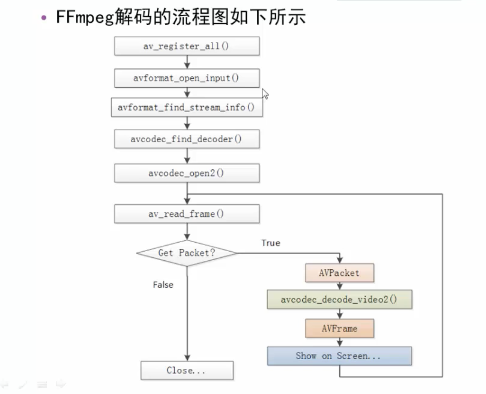

# FFmpeg 基本命令
- 转换数据格式:ffmpeg -i in.mp4 -vcodec copy -acodec copy out.flv
> 参数含义 -vcodec 表示拷贝视频, -acodec表示拷贝音频;
> -an表示不要音频，-vn表示不要视频, -ar音频的采样率，-ac2 channel:音频的单声道，双声道，环绕立体声。
> -f 音频的数据存储格式,s16le, l: little end小头

- 滤镜命令:-vf滤镜，宽度高度200，视频编码器x264,不对音频做特殊处理。
```shell
ffmpeg -i in.mov -vf crop=in_w-200:in_h-200 -c:v libx264 -c:a copy out.mp4 

```

- 视频裁剪与合并
```shell
#裁剪
ffmpeg -i in.mp4 -ss 00:00:00 -t 10 out.ts
#合并 onputs.txt是文件列表，所有文件格式: file filename
ffmpeg -f concat -i inputs.txt out.flv
# echo "file '1.ts'" > inputs.txt
# echo "file '2.ts'" > inputs.txt
```
> 原始数据的数据量越大，处理时间更长.

- 图片转视频，视频转图片
```shell
ffmpeg -i image-%3d.jpeg out.mp4
ffmpeg -i out.mp4 -r 1 -f image2 image-%3d.jpeg
```
- 直播推拉流
```shell
# -推流:re帧率保持同步
ffmpeg -re -i out.mp4 -c copy -f flv rtmp://server/live/streamName
# 拉流 保存的格式与拉流的格式一致
ffmpeg -i rtmp://server/live/streamName -c copy dump.flv

# 配置rtsp
ffmpeg -re -i 4k.mp4 -vcodec copy -codec copy -f rtsp rtsp://210.37..:554/live/rtsp

```
# FFmpeg代码结构
- libavcodec 提供了一系列编码器的实现
- libavformat 实现流协议，容器格式及其本IO访问
- libavutil 包括了hash器，解码器和各种工具函数
- libavfilter 提供了各种音视频过滤器
- libavdevice 提供了各种捕获设备和回放设备的接口
- libswresample 实现了混音和重采样
- libswscale 实现了色彩转换和缩放功能

# FFmpeg解码流程


# ffmpeg编译静态文件
-  
