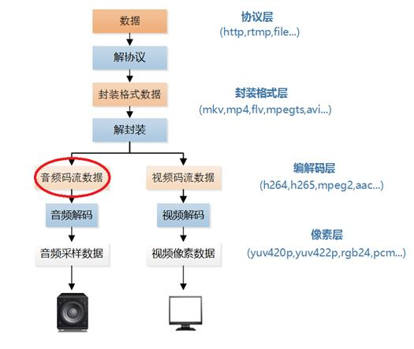

# 音视频学习参照[雷神的csdn](https://blog.csdn.net/leixiaohua1020?type=blog) 
主要是学习时的笔记
# 视频播放器的原理
- 视频播放器播放视频文件主要原理是:解协议，解封装，解码视音频，视音频同步。
-  
	- 解协议的作用，就是将流媒体协议的数据，解析为标准的相应的封装格式数据。视音频在网络上传播的时候，常常采用各种流媒体协议，例如HTTP,RTMP.或者是MMS等等，这些数据在传输音视频数据的同时，也会传输一些信令数据，这些信令数据包括对播放的控制(播放，暂停，停止),或者对网络状态的描述等。解协议的过程中会去除信令数据而只保留音视频数据，例如，采用RTMP协议传输的数据，经过解协议操作后，会输出FLV格式的数据。
	- 解封装的操作，就是将输入的封装格式的数据，分离成音频流压缩编码数据和视频流压缩编码数据。封装格式有很多种类，例如MP4,MKV,RMVB,TS,FLV,AVI等，它的作用就是将已经压缩编码的视频数据和音频数据按照一定的格式放在一起，例如：FLV格式的数据，经过解封装操作后，输出H.264编码的视频码流和AAC编码的音频码流。
	- 解码的作用就是将视频/音频压缩编码数据，解码成为非压缩的视频/音频原始数据，音频的压缩编码标准包含ACC,MP3,AC-3等等，视频的压缩编码标准则是包含H.264,MPEG2,VC-1等等。解码是整个系统中最重要也是最复杂的环节。通过解码，压缩编码的视频数据输出成为非压缩的颜色数据，例如：YUV420P, RGB等等；压缩编码的音视频数据输出成为非压缩编码的音频抽样数据，例如PCM数据。
	- 视音频同步的作用：就是根据解封装模块处理过程中获取到的参数信息，同步解码出来的视频和音频数据，并将视频音频数据送至系统的显卡和声卡播放出来。
# rtmp分析
- 
rtmp传输媒体数据的过程中，发送端首先把媒体数据封装成消息，然后把消息分割成消息块，最后将分割后的消息块通过TCP协议发送出去，接收端在通过TCP协议收到数据后，先把消息块重新组合成消息，然后通过对消息进行封装处理就可以恢复出媒体数据。
# UDP-RTP协议分析

# SDL配置
- SDL(Simple DirectMedia Layer)库的作用是封装了复杂的视音频低层交互工作，简化视音频处理的难度。
