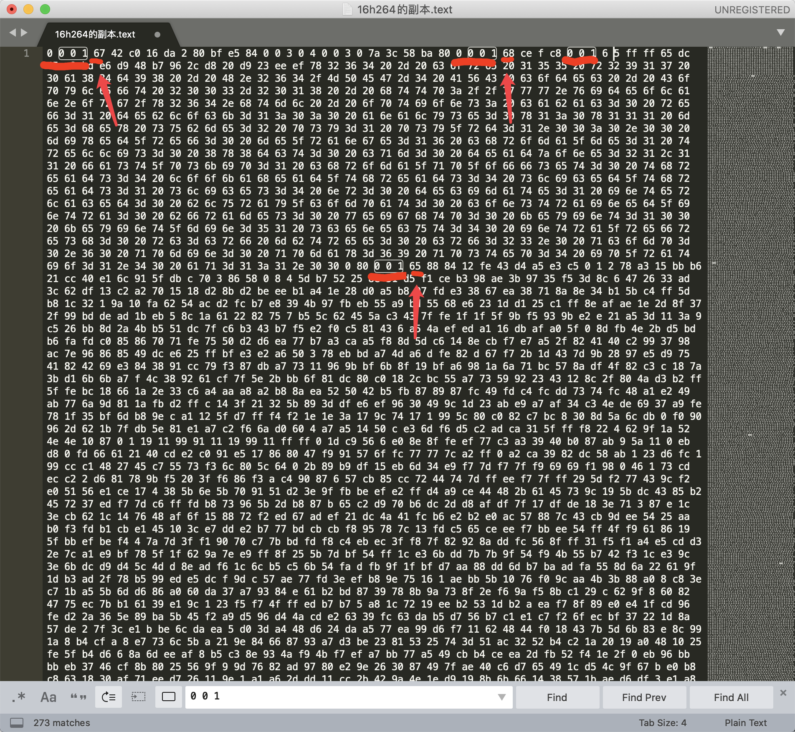
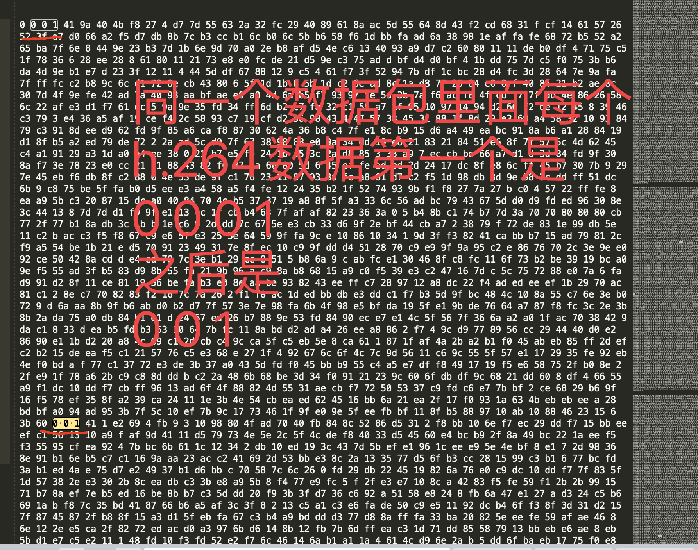
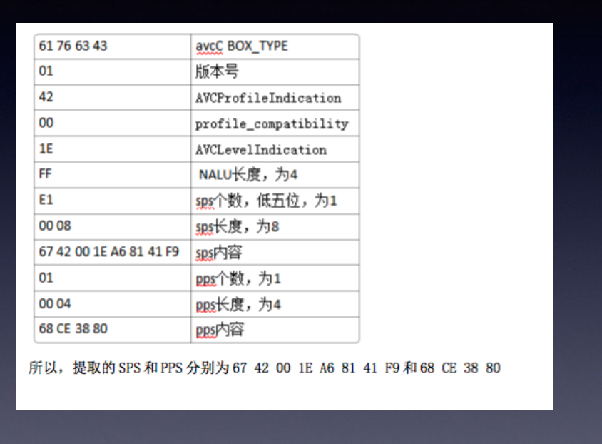
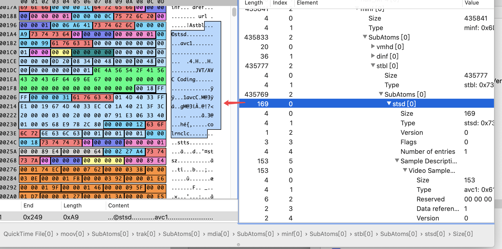

- 音视频开发

音视频并不是一个标准和协议，在不同行业中，音视频是完全不同的技术。不同行业要解决的核心问题不同，导致了不同体系的音视频技术,
- 直播行业主要应用的是:rtmp,flv,HLS; --- 要解决的问题是高清，流畅
- 通话行业使用的更多的是webrtc; --- 解决的延迟关键，声学
- 监控安防:rtsp,gb28181,ONVIF; --- 解决随时看到之前的内容，物体识别

各个行业需要就借助互联网的力量实现数字化，--- 电商--->直播电商;

音视频是一种能力，各个行业都在探索，通过音视频实现增值;--- 数字化的能力;

srs的核心要解决的问题：**解决流媒体的网关** 
- 编码方式和封装格式：编码方式主要有:视频编码格式H264,H265,Xvid,音频编码格式:mp3,AAC；封装格式:是TS, AVI,MKV MP4;
# clion编译
- 主要编译方式采用docker的方式。
- 修改cmakeList.txt主要是：
```
#execute_process(
#        COMMAND bash -c "cd ${PROJECT_SOURCE_DIR}/../../ && pwd"
#        OUTPUT_VARIABLE SRS_DIR
#)
SET(SRS_DIR /tmp/trunk)
```
# mac运行srs
- lldb调试
```shell
lldb -- ./objs/srs -c conf/console.conf
b SrsConfig::parse_options
bt
f
p argc
p argv
p argv[0]
p argv[1]
p argv[2]
b 1907
p config_file

```
- 解决配置文件兼容性的函数
```
src_config_transform_vhost(root)
```

# srs做什么
- 流媒体网关，填协议转换的坑，小微场景的应用.

### WebRTC标准和架构
WebRTC不只有一个RFC,核心RFC大概有WebRTC,DTLS,SRTP,RTP,STUN,以及各种扩展。

# srs(流媒体网关)解决什么问题
互联网音视频是主要RTMP接入，逐步也支持SRT和WebRTC,而观看则主要是HLS和WebRTC.
只有媒体网关，才能再各种场景中，适配其他行业的标准，或者转换不同推流协议。
技术先进不是决定性的，能服务好业务的协议就有自己的生存空间。

# srs应用的语言技术
- c++98,减少功能，思考最佳结构，本质上都是人的问题。
- Lightweight Thread 音视频是C的生态，解决固有难题的复杂性，只有通过轻量线程.
- JS的扩展，是有利于社区贡献的最佳方式，架构上必须支持扩展。


# srs支持的协议
```
RTMP推流--------------|     |------------RTMP播放
WebRTC推流------------|     |------------HLS播放
GB-28181推流----------|     |------------HTTP-FLV播放
SRT推流---------------| SRS |------------WebRTC播放
MPEG-TS推流-----------|     |------------HDS播放
HTTP-FLV推流----------|     |------------MP4/FLV录制
FFmpeg拉RTSP----------|
```
- RTMP是最流行的直播协议。
- HLS是苹果的协议，缺点是延迟高，严格上讲不是一个流协议，而是一个文件协议，服务器会将音视频数据打包成一小段一线段的ts切片
- HTTP-FLV（无插件播放）不是一个标准的w3c标准的流媒体协议，利用了http Chunked特性，然后HTTP Body数据类型就是FLV跟RTMP的类型差不多，对于服务器来说处理容易，平滑的切换
浏览器接收到数据后，用flv.js这个库重新组装数据，通过MSE给到浏览器，从而实现了视频播放的功能。
- WebRTC无插件播放，目前最火的流媒体协议，对于前端开发者更加方便，几行代码就可以实现采集，渲染，编解码，缺点是底层技术栈太难。
- 安防类协议RTSP是与RTMP一字之差，延迟低，两者的主要区别是RTMP的Payload是FLV,而RTSP得payload是RTP，最主要得区别还是应用场景，RTSP主要是在内网使用，因为每个摄像头是可以把他理解成一个RTSP得server,如果看视频得化，主动去摄像头拉流。摄像头是不会主动推流的。所以主要的问题是处在公网的服务器或者客户端时无法看到内网的摄像头的视频。
- GB-28181协议，是公安一所联合摄像头厂家定制的协议, 专门适用于安防领域的协议。指定这个协议的目的是为了解决RTSP的问题，公网的服务器无法访问内网的摄像头，所以GB28181协议就是一个摄像头 主动注册，并且向外推流的协议，有两个版本，一个是2011年的UDP协议，后来发现上了公网后丢包很严重，又做了补充协议，改成了TCP,互联网上面的协议最开始是TCP,逐渐演进到现在是UDP(比如webrtc),安防是在局域网使用，网络条件好，采用UDP传输，后边上云后，发现丢包严重，各种卡顿，花屏，然后做了一个补充协议，所以安防做了一个适用于本地存储的，或者是局域网传输的PS打包，而不是选择适用于网络传输的TS打包，历史原因。PS打包比较复杂，首先是可变长度，被丢包后很难恢复，里面有一些扩展字段，每个厂家理解不一致，从而引起一些兼容性问题，还有一些厂家喜欢加点私货，所以目前SRS目前会出现decode ps data error这种错误。

# 使用场景
- 视频直播，主播通过OBS推流到SRS，转封装成HTTP-FLV流，转封装成HLS;Players根据平台的播放器可以选HTTP-FLV或HLS流播放；
- WebRTC通话业务，多人通话，视频会议电子白板;
- 安防监控领域，使用FFmpeg拉取RTSP再转RTMP推送到SRS,或者使用GB28181协议直接推流，Players可以使用WebRTC播放;
- 广电领域，可以使用SRT协议推流

# 安防云边端 
- 云端：调度系统；指令系统，数据系统，SRS
- 边缘端：视频网关，边缘负责拉流然后转推到云端；SDK接入 RTSP接入 GB28181接入-----------> 实时预览，历史回放   设备管理，报警上报 协议转换，事件联动| 抓图下载,指令控制
- 设备端：IPC DVR NVR; 球机墙机红外机，

# 流媒体

- 摄像头多了需要有一个下级服务器，类似于IP网络中的NAT子网
# 安防特殊流程

- 码率随着播放时间的减小，也是成倍增加的，1080P是4兆的码流，2倍速码率就变成了8兆，四倍速就是16兆（sleep时间少了）；cpu的消耗也是增加的，安防就是有初帧操作，不能把I帧扔掉，否则P帧就不能接触来了。根据倍速，I帧的时间间隔，有一个抽帧的算法。减轻带宽的压力，减轻解码的压力，慢放就是时间间隔加长就好了。

# 延迟问题
- 采集渲染：硬件设备，主要延迟几毫秒，到十几毫秒
- 编码和解码：编码类型：I帧，P帧，B帧 编码格式：AVC,HEVC,VP8,VP9,AVI等；I帧时间间隔；B帧会带来额外的延迟，相对于I,P帧来说是一个双向预测，可能会参考前面和后面的帧，客户端解码的时候也是一样，收到一个B帧后，可能也是解不出来，必须等到参考帧到达后才能解码，所以就造成了可能会有几十毫秒的延迟，加起来就可能有100多毫秒的延迟。H265是H264的升级版，压缩率会提高大概30%左右，更高的编码，更高的压缩率带来的就是更长的编码时长，I帧间隔会对网络造成冲击，因为I帧这个包比较大,会造成网络抖动，应用层(HLS RTMP HTTP-FLV)延迟最高的就是HLS,传输层(UDP和TCP);
- 网络传输：传输协议，应用层和传输层，缓存，服务端和播放端
- 性能优化：合并读写; 缓存350ms的一个数据，就能提升差不多一倍的并发，降低延迟，可以将缓存关掉。

# srs不支持的协议
- onvif 
- RTSP
<br>这两个协议都是局域网协议，处在公网的SRS是没有办法使用这两个协议，
---

# SRS的docker启动
- [参考](https://github.com/ossrs/dev-docker/tree/aarch64) 

# 小试牛刀
## rtmp推拉流
- step1 开启srs服务
```shell
cd ~/git/srs/trunk &&
docker run -p 1935:1935 -p 1985:1985 -p 8080:8080 -p 8085:8085 \
		        -it --rm -v `pwd`:/srs -w /srs ossrs/srs:aarch64 \
				    ./objs/srs -c conf/rtc.conf
```
- step2 ffmpeg推流
```shell
# ip为本机ip
ifconfig en0
ffmpeg -re -i ./doc/source.flv -c copy -f flv -y rtmp:://192.216.229.57/live/livestream
```
- step3 ffmpeg拉流
```shell
ffplay rtmp://192.216.223.154/live/livestream
```
- step4 srs播放器
- 访问http://localhost:8080 选择srs播放器，填写URL: http://localhost:8080/live/livestream就可以播放
- step5 GDB调试
```shell
# To run docker with --privileged for GDB, or it fail for error Cannot create process: Operation not permitted.
cd ~/git/srs/trunk &&
docker run -p 1935:1935 -p 1985:1985 -p 8080:8080 -p 8085:8085 \
		        --privileged -it --rm -v `pwd`:/srs -w /srs ossrs/srs:aarch64 \
				    gdb --args ./objs/srs -c conf/console.conf
```

## rtmp推流 webrtc播放

# srs源码分析
## 配置文件
- srs配置文件参照ngx；函数ngx\_conf\_read\_token函数
```cpp
static int ngx_conf_read_token(ngx_conf_t *cfg)
{
	int found = 0; // 用来表示是否找到一个完整的token
	int need_space; // 用来接下来扫描到的字符需要是空格/水平制表符/回车符/换行符时置为1
	int sharp_comment=0; // 用来表示当前扫描的字符是否在一个#开头的行注释中
	
	
	// quoted:扫描到转义序列的\时置为1
	// s_quoted:当扫描到一个单引号时置为1
	// d_quored:当扫描到一个双引号时置为1
	int quoted, s_quoted,d_quored;
	cfg->args; //用来获取解析到的token


}
```

- [参考源码分析](https://github.com/xialixin/srs_code_note/blob/master/doc/srs_note.md)

- [奋斗企鹅CopperSun](https://blog.csdn.net/qq_27788177/article/details/116500700)


# h.264  帧介绍

 
# 1. 三种帧的说明

## 1. 1 I 帧概念
- I帧: 帧内编码帧，I帧表示关键帧，你可以理解为这一帧画面的完整保留;解码时只需要本帧数据就可以完成(因为包含完整画面)


## 1.2 I帧特点:

1. 它是一个全帧压缩编码帧。它将全帧图像信息进行JPEG压缩编码及传输;
2. 解码时仅用`I帧`的数据就可重构完整图像;
3. `I帧`描述了图像背景和运动主体的详情;
4. `I帧`不需要参考其他画面而生成;
5. `I帧`是`P帧`和`B帧`的参考帧(其质量直接影响到同组中以后各帧的质量);
6. `I帧`是`帧组GOP`的`基础帧`(`第一帧`),在`一 组`中只有一个`I帧`;
7. `I帧`不需要考虑运动矢量;
8. `I帧`所占数据的信息量比较大。
## 1.3 B帧概念
- `B帧`: `双向预测`内插编码帧。
- `B帧`是`双向差别帧`，也就是B帧记录的是**本帧与前后帧的差别**(具体比较复杂，`有4种情况`，但我这样说简单些).
- 换言之，要解码`B帧`，`不仅`**要**取得`之前`的缓存画面，**还要**解码`之后`的画面，通过`前后`画面的与`本帧数据`的`叠加`取得最终的画面。B帧压缩率高，但是解码时CPU会比较累。
## 1.4 B帧的预测与重构
- `B帧`以**前面**的`I`或`P帧`和**后面**的`P帧`为参考帧.
- **找出**`B帧`**某点**的`预测值`和两个`运动矢量`, 并取预测差值和运动矢量传送。
- 接收端根据运动矢量在两个参考帧中 **找出(算出)** 预测值并与差值求和，得到B帧**某点**样值，从而可得到完**整**的`B帧`。
## 1.5 B帧特点

1. `B帧`是由`前面`的`I`或`P帧`和**后面**的`P帧`来进行预测的;

2. `B帧`**传送**的是它与**前面**的`I`或`P帧`和**后面**的**P帧**之间的`预测误差`及`运动矢量`;
3. `B帧`是`双向预测编码帧`;
4. `B帧`**压缩比最高**,因为它只反映丙参考帧间运动主体的变化情况，预测比较准确;
5. `B帧`**不是**`参考帧`，**不会**`造成``解码错误`的`扩散`。
### PS
`I`, `B`, `P` 各帧是根据压缩算法的需要, 是人为定义的, 它们都是实实在在是物理帧.
一般来说, 
- `I帧` 的压缩率是`7` (跟JPG差不多)
- `P帧` 的压缩率是`20`
- `B帧` 的压缩率可以达到`50`

可见使用B帧能节省大量空间, 节省出来的空间可以用来保存多一些`I帧`, 这样在相同码率下, 可以提供更好的画质.


## 1.6 P帧概念

- `P帧`:  `前向预测`**编码帧**.
- `P帧`表示的是这一帧跟`之前`的`关键帧`(或`P帧`)的差别,  `解码时`需要用`之前`缓存的画面叠加上本帧定义的差别, 生成最终画面.
- 也就是差别帧, `P帧`**没有**`完整的画面`数据, **只有**与前一帧的画面`差别数据`
## 1.7 P帧的预测与重构

`P帧的预测与重构`:
- `P帧`是以`I帧`为`参考帧`，在`l帧`中找出`P帧`**某点**的`预测值`和`运动矢量`，取`预测差值`和`运动矢量`一起传送。
- `在接收端`**根据**`运动矢量`从`I帧`中找出`P帧``某点`的`预测值`**并与**`差值`**相加**以得到`P帧`**某点**样值，从而可得到完整的P帧。

## 1.8 P帧特点:

1. `P帧`是`I帧`**后面**相隔1~2帧的编码帧;

2. `P帧`采用`运动补偿`的方法**传送**它与**前面**的`I`或`P帧`的**差值**及**运动矢量(预测误差);**

3. 解码时必须将`I帧`中的`预测值`与`预测误差`**求和**后才能重构完整的**P帧**图像;

4. `P帧`属于`前向预测`的`帧间编码`。它`只参考`**前面**`最靠近它`的`l帧`或`P帧`;

5. `P帧`**可以**是其**后面**`P帧`的参考帧，**也可以**是其`前后`的`B帧`的参考帧;

6. 由于`P帧`是参考帧，`它可能`造成`解码错误的扩散`;

7. 由于是**差值传送**，`P帧`的压缩比较高。


## 1.9 h264的压缩方法

1. `分组`: 把几帧图像分为一组(`GOP,` 也就是一个序列), 为防止运动变化, 帧数不宜取多
2. 定义帧: 将`每组`内各帧图像`定义为`**三种类型**, 即`I帧`, `B帧`和`P帧`
3. 预测帧: 以`I帧`做为基础帧, 以`I帧`预测`P帧`, 再由`I帧`和`P帧`预测B帧
4. 数据传输: 最后将`I帧`数据与`预测的差值信息`进行存储和传输

- `帧内(Intraframe) 压缩`也称为`空间压缩(Spatial compression)`当压缩一帧图像时，仅考虑本帧的数据而`不考虑相邻帧`之间的`冗余信息`，这实际上与静态图像压缩类似。`帧内`一般采用`有损压缩`算法，由于帧内压缩是编码一个完整的图像，所以可以独立的解码、显示。帧内压缩一般达不 到很高的压缩，跟编码jpeg差不多。

- `帧间(Interframe) `压缩的原理是:`相邻几帧`的数据有很大的`相关性`，或者说`前后两帧`信息变化很小的特点。也即连续的视频其相邻帧之间具有冗余信息根据这一特性， 压缩相邻帧之间的冗余量就可以进一步提高压缩量，减小压缩比。帧间压缩也称为`时间压缩(Temporal compression)`，它通过比较时间轴上不同帧之间的数据进行压缩。`帧间`压缩一般是`无损的`。`帧差值(Frame differencing)`算法是一 种典型的时间压缩法，它通过比较本帧与相邻帧之间的差异，仅记录本帧与其相邻帧的差值，这样可以大大减少数据量。

- 顺便说下`有损(Lossy )压缩`和`无损(L ossy less)压缩`。`无损压缩`也即`压缩前`和`解压缩后`的数据`完全一致`。多数的无损压缩都采用`RLE行程编码`算法。`有损压缩`意味着`解压缩后`的数据`与压缩前的数据不一致`。在压缩的过程中要丢失一些人眼和人耳所不敏感的图像或音频信息，而且丢失的信息不可恢复。几乎所有`高压缩的算法`**都**`采用`**有损压缩**这样才能达到低数据率的目标。丢失的数据率与压缩比有关压缩比越小，丢失的数据越多，解压缩后的效果一般越差。此外，某些有损压缩算法采用多次重复压缩的方式，这样还会引|起额外的数据丢失。
# 1.10 H.264NAL头解析
为了进行网络传输就有了NAL
- 如果`NALU`对应的`Slice`为一帧的**开始**,  **则**用`4个字节`表示, 即`0x00 00 00 01`; **否则**用`3字节`表示, `0x 00 01`
- **NAL header**: 
    - `forbidden_bit`, 
    - `nal_reference_bit`(优先级) 2bit,
    - `nal_unit_type`(类型) 5bit
标识`NAL单元`中的`RBSP`类型, 其中`nal_unit_type` 取值为`1,2,3,4,5`的`NAL单元`称为`VLC的NAL单元`, 其他类型的`NAL单元`为`非VLC`的`NAL单元`
- `0`:未规定
- `1`:非IDR图像中不采用数据划分的片段
- `2`:非IDR图像中A类数据划分片段
- `3`:非IDR图像中B类数据划分片段
- `4`:非IDR图像中C类数据划分片段
- `5`: IDR图像的片段
- `6`:补充增强信息(SEI)

- `7`: **序列参数集(SPS)** ----重点
- `8`: **图像参数集(PPS)** ----重点

- `9`:分割符
- `10`:序列结束符
- `11`:流结束符
- `12`:填充数据
- `13`:序列参数集扩展
- `14`:带前缀的NAL .单元
- `15`:子序列参数集
- `16- 18`:保留
- `19`:不采用数据划分的辅助编码图像片段20:编码片段扩展
- `21-23`:保留
- `24 - 31`:未规定
# 1.11 SPS和PPS
`H.264`的`SPS`和`PPS串`, 包含了`初始化H.264`**解码器**所需要的信息**参数**, 包括**编码**所用的`profile`, `level`, `图像的宽和高`, `deblock滤波器`等.
码率: 256~512 kb/s
帧率: 15~20 fps
分辨率: `1280x720(HD)`,  `640x368(VGA)`, `1920x1080(UHD)`
# 1.12  h264常见的帧头数据
  h264常见的帧头数据为：

- 00 00 00 01 67    (`SPS`)

- 00 00 00 01 68    (`PPS`) 

- 00 00 00 01 65    ( `IDR 帧`) 

- 00 00 00 01 61    (`P帧`)
# 1.13 h264数据说明





`0 0 0 1` 或者 `0 0 1` 是每个264的开头 后面的一个字节是 `NAL头` 入图中紧跟着的 `41` `67` `68` `65` 这都是16进制, 我是要将它们转成二进制来看

16进制的`68`转二进制为`0 1 1 0 1 0 0 0`
16进制的`67`转二进制为`0 1 1 0 0 1 1 1`
16进制的`65`转二进制为`0 1 1 0 0 1 0 1`
16进制的`41`转二进制为`0 1 0 0 0 0 0 1`


第一位 为F
第2-3位 为NRI
第4-8位为Type

- F：禁止为，0表示正常，1表示错误，一般都是0

- NRI：重要级别，11表示非常重要。

- TYPE：表示该NALU的类型是什么，见下表7.20，由此可知7为序列参数集(SPS)，8为图像参数集(PPS)，5代表I帧。1代表非I帧。由此可知，61和41其实都是P帧（type值为1），只是重要级别不一样（它们的NRI一个是11BIN，一个是10BIN）


16进制的`68`的后五位type就是`0 1 0 0 0`转为10进制为`8`, 也就是**图像参数集(PPS)**
16进制的`67`的后五位type就是`0 0 1 1 1`转为10进制为`7`, 也就是**序列参数集(SPS)**
16进制的`65`的后五位type就是`0 0 1 0 1`转为10进制为`5`, 也就是**I帧**
16进制的`41`的后五位type就是`0 0 0 0 1`转为10进制为`1`, 也就是`非I帧(B或者P)`

- Video25: 对应视频:`025. 13 QuickTime mp4容器分析_recv.ev4`
- Video26: 对应视频:`026. 14 AAC 音频格式_recv.ev4`
- Video27: 对应视频:`027.15 AAC实时转换 1_recv.ev4`
- Video28: 对应视频:`028. 16 AAC实时转换 2_recv.ev4`


# MP4格式
## 1.  MP4格式(H. 264+AAC)
1. MP4格式对应标准为ISO/IEC 14496-12(信息技术 视听对象编码的第12部分: IS0 基本媒体文件格式 /Information technology Coding of audio-visual objects Part 12: ISO base media file format) 附--标准免费下载: Freely Available

2. MP4封装格式是基于QuickTime容器格式定义，媒体描述与媒体数据分开，目前被广泛应用于封装h.264视频和ACC音频，是高清视频/HDV的代表。

3. MP4文件中所有数据都封装在`box`中(对应QuickTime中的`atom`),即MP4文件是由若干个box组成，每个box有`长度`和`类型`，每个box中还可以包含另外的`子bo`x (称`container box`) 。

4. MP4中box存储方式为`大端模式`。一般，标准的`box开头`会有四个字节的`box size`.

- 一个MP4 文件**首先**会`有且只有`**一个**“**ftyp**” 类型的**box**,作为MP4格式的标志并包含关于文件的一些信息;
- **之后**会`有且只有`一个“**moov**”`类型`的`box` (`Movie Box`),它是一种`container box`,`子box`包含了媒体的`metadata信息`;
- MP4文件的`媒体数据`包含在“**mdat**” `类型`的box (`Midia Data Box`) 中，该类型的box也是`container box`, `可以有多个`，`也可以没有`(当媒体数据全部引用其他文件时)，媒体数据的结构由`metadata` 进行描述。


---

- **track**: 表示一些`sample`的集合，对于媒体数据来说，`track`表示一个`视频`或`音频`**序列**。

- **hint track**: **特殊的**`track`, `并不包含`**媒体数据**，包含的是一些`将``其他数据track` **打包**成`流媒体`的`指示信息`。

- **sample**: 对于`非hint track`来说， `video sample`即为`一帧视频`，**或**`一组`**连续**`视频帧`， `audio sample`即为`一段`**连续**的`压缩音频`，它们**统称**`sample`.对于`hint track,` **sample**定义`一个`或`多个`**流媒体包**的格式。

- **sample table**:  指明`sample`**时序**和**物理布局**的表。

- **chunk** :一个**track**`的`几个**sample** **组成**的**单元**。


## mp4 Info 工具






# 2. AAC
AAC (Advanced Audio Coding) , 中文名: `高级音频编码`，出现于1997年，**基于**`MPEG- 2`的音频编码技术。由Fraunhofer IIS、杜比实验室、AT&T、Sony等公司共同开发，目的是取代MP3格式。2000年，MPEG-4标准出现后，AAC 重新集成了其特性，加入了`SBR`技术和`PS`技术，为了区**别于**传统的`MPEG-2 AAC`又称为`MPEG-4 AAC`。

- `优点`: 相对于mp3，AAC格式的`音质更佳`，`文件更小`。

- `不足`: AAC属于`有损压缩`的格式，与时下流行的APE、FL AC等无损格式相比音质存在“本质上”的差距。加之，传输速度更快的USB3.0和16G以上大容量MP3正在加速普及，也使得AAC头.上“小巧”的光环不复存在了。

## 2.2 音频采样率
`音频采样率` 是指录音设备在`一秒钟内`对声音信号的`采样次数`，采样频率越高声音的还原就越真实越自然。在当今的主流采集卡上，采样频率一般共分为22.05KHz、44. 1KHz、48KHz三个等 级，22.05KHz只能达到FM广播的声音品质，44. 1KHz则是理论.上的CD音质界限，48KHz则更加精确些.。
## 2.3 比特率
- `比特率`是指`每秒`传送的`比特(bit)数`。单位为 `bps` (`Bit Per Second`), 比特率越高，传送数据速度越快。**声音中**的比特率是指将`模拟声音信号`转换成`数字声音信号`后，单位时间内的`二进制数据量`，是间接衡量音频质量的一个指标。**视频中**的比特率(码率) 原理与声音中的相同，都是指由**模拟**信号**转换**为**数字**信号后，单位时间内的二进制数据量。

- 信道编码中，`K符号`大小的信源数据块通过编码映射为`N符号`大小的码字，则`K/N` 成为码率，其中假设编码前后的符号表没有变化。

## 2.3 采样精度

`采样精度`决定了记录声音的`动态范围`，它以位(`Bit`)为 **单位**，比如`8位`、 `16位`。`8位`可以把声波分成`256级`，`16位`可以把同样的波分成`65`, `536级`的信号。可以想象，位数越高，声音的保真度越高。

- 采样精度`样本大小`是用每个声音样本的`位数bit/s`(`即bps`)表示的，它反映`度量`**声音波形**`幅度`的精度。例如，每个声音样本用`16位(2字节)`表示，测得的声音样本值是在`0~ 65535`的范围里，它的精度就是输入信号的1/65536. 样本位数的大小影响到声音的质量，位数越多，声音的质量越高，而需要的存储空间也越多; 位数越少，声音的质量越低，需要的存储空间越少。

- `采样精度`的另一种`表示方法`是**信号噪声比**，简称为`信噪比`(**signal-to-noise ratio,SNR**)，并用下式计算:
  - SNR= 10 log [(Vsignal)2 / (Vnoise)2]=20 log (Vsignal / Vnoise)

  - `Vsignal`表示信号`电压`，`Vnoise`表示噪声 `电压`; SNR的单位为`分贝(dB)`。

  - 例1:假设Vnoise=1, 采样精度为1位表示Vsignal=2的1次方，它的信噪比SNR=6分贝。

  - 例2:假设Vnoise=1, 采样精度为16位表示Vsignal=2的16次方，它的信噪比SNR=96分贝。


# 音视频中的一些概念(GOP，PTS和DTS......)
- GOP即Group of pictrue(图像组),指的是两个I帧之间的距离，Reference(参考周期)指的是两个P帧之间的距离，一个I帧所占用的字节数大于一个P帧，一个P帧所占用的字节数大于一个B帧。所以在码率不变的前提下，GOP值越大，P、B帧的数量会越多，平均每个I、P、B帧所占用的字节数就越多，也就更容易获取较好的图像质量；Reference越大，B帧的数量越多，同理也更容易获得较好的图像质量。在遇到场景切换的情况时，H.264编码器会自动强制插入一个I帧，此时实际的GOP值被缩短了。另一方面，在一个GOP中，P、B帧是由I帧预测得到的，当I帧的图像质量比较差时，会影响到一个GOP中后续P、B帧的图像质量，直到下一个GOP开始才有可能得以恢复，所以GOP值也不宜设置过大。
- DTS（Decoding Time Stamp）：即解码时间戳，这个时间戳的意义在于告诉播放器该在什么时候解码这一帧的数据。
- PTS（Presentation Time Stamp）：即显示时间戳，这个时间戳用来告诉播放器该在什么时候显示这一帧的数据。
- 采样率(sample rate),采样就是每秒钟从连续信号中提取并组成离散信号的采样个数，它用赫兹(hz)表示，简单来说就是每秒钟在每个声道上采样的个数。sample 是一个声道的一个采样。 frame 是一个时间点的样本集合，举例来说，一个线性的PCM 双声道音频文件每个Frame有2个样本，一个左声道样本，和一个右声道样本。 packet 是一个或多个frame 的集合，一个packet 包含多少个frame，是由声音文件格式决定的。
