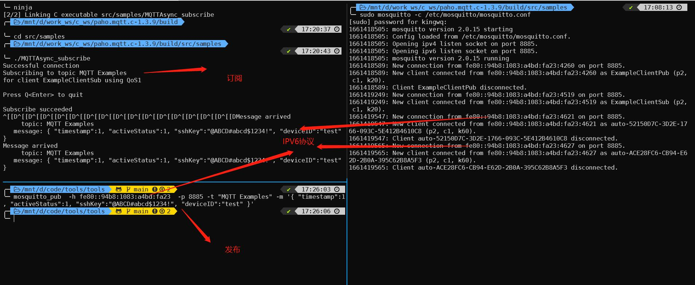

# mosquitto 设置
- mosquitto version 2.0.14及以上不支持1883端口。
- 修改mosquito的配置文件为:
```
listener 8885
allow_anonymous true
```

# mqtt设置
- 配置非加密为ssl地址: 本机ip
- 打开终端订阅topic:
```shell
mosquitto_sub -h 192.216.223.11 -p 8885 -t "vpub/status"
```
- 发布topic:
```
mosquitto_pub -t 'buildchange' -m '{"state":"building","resultKey":"IRNG-CORE-GC-JOB1-197","chainName":"BRANCH-IR-1-123"}'
```

# mosquitto报错问题
- 1658805743: Client R331213120410000121658805744 disconnected due to malformed packet.
> 这个问题一般是topic不合法，打印topic看一下

# mqtt遗言
- 遗言只有当程序异常退出才会触发
- 通过tcpdump抓包可以看出，建立连接过程。
# ipv6部分
```
ping6 fe80::2ee:3ff:fed6:3884
tcpdump -i eth0 host  fe80::2ee:3ff:fed6:3884 -X
#url
domain 类型
tcp://iot.eclipse.org:1883

ipv4 类型
tcp://192.168.10.1:1883
ssl://192.168.10.1:1884

ipv6 类型
tcp://[fe80::20c:29ff:fe9a:a07e]:1883
ssl://[fe80::20c:29ff:fe9a:a07e]:1884
```



# mqtt消息过滤
```
tcpdump -i eth0 tcp port 1883 -A | grep register/up
```
- tcpdump 参数
	- -A Print each packet (minus its link level header) in ASCII. Handy for capturing web pages.
	　　　　 以ASCII码方式显示每一个数据包(不会显示数据包中链路层头部信息). 在抓取包含网页数据的数据包时, 可方便查看数据　
	- -c tcpdump在接收到count个数据后退出

