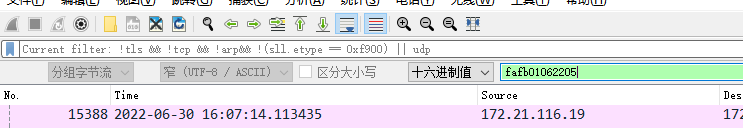

# mqtt包查看

- 右键解析协议：选中一条报文--> Decode As ---\>mqtt
- 如何查看谁先断开，fin 或者RST

# 过滤hex



# 通过wireshake查看fin

```
(mms||((tcp.port == 102)&&(tcp.flags.fin==1||tcp.flags.reset==1||tcp.flags.syn==1))||(cotp.type==0x0d)||(cotp.type==0x0e)||(cotp.type==0x08))
```

# 通过数据内容过滤

```
tcp.port == 2404 && (tcp contains 852A)
```

# tcpdump过滤, 具体的buffer是从ether[0]开始计算的

```
tcpdump直接解的少了14个头
12:29:27.607700 00:53:46:01:00:15 (oui Unknown) > Broadcast, ethertype 802.1Q (0x8100), length 294:
        0x0000:  0000 88d8 0b01 f4fe 0080 0000 0000 6052  ..............`R
        0x0010:  0133 9600 80a2 0000 0063 0100 0100 6300  .3.......c....c.
        0x0020:  0002 0063 0100 0300 6300 0004 00a0 8000  ...c....c.......
        0x0030:  0500 a030 0006 0063 1e00 0700 b030 0008  ...0...c.....0..
        0x0040:  00b0 0800 0900 b010 000a 00b0 0000 0b00  ................
        0x0050:  6300 000c 00b0 0000 0d00 b000 000e 0063  c..............c
        0x0060:  0f00 0f00 6301 0010 0063 0200 1100 6303  ....c....c....c.
        0x0070:  0012 0063 0400 1300 6303 0014 0063 0300  ...c....c....c..
        0x0080:  1500 6302 0016 0063 0100 1700 63f6 0018  ..c....c....c...
        0x0090:  0063 f600 1900 63f6 001a 0063 f600 1b00  .c....c....c....
        0x00a0:  b000 001c 0063 f600 1d00 63f6 001e 0063  .....c....c....c
        0x00b0:  dc00 1f00 63f6 0020 00b0 0000 2100 b000  ....c.......!...
        0x00c0:  0022 0063 5a00 2300 6301 0024 0063 0200  .".cZ.#.c..$.c..
        0x00d0:  2500 6303 0026 0063 0400 2700 6302 0028  %.c..&.c..'.c..(
        0x00e0:  0063 0300 2900 6301 002a 0063 0200 2b00  .c..).c..*.c..+.
        0x00f0:  6303 002c 0063 0400 2d00 6305 002e 0063  c..,.c..-.c....c
        0x0100:  0400 2f00 6306 0030 0063 0400 3100 6306  ../.c..0.c..1.c.
        0x0110:  0039 9192                                .9..
这个是代码中的位置, 这个是对的，wireshake中的不对，多了四个
ff ff ff ff ff ff 00 53 46 01 00 15 40 02 00 00
 88 d8 0b 01 f4 fe 00 80 00 00 00 00 60 52 01 33
 96 00 80 a2 00 00 00 63 01 00 01 00 63 00 00 02
 00 63 01 00 03 00 63 00 00 04 00 a0 80 00 05 00
 a0 30 00 06 00 63 1e 00 07 00 b0 30 00 08 00 b0
 08 00 09 00 b0 10 00 0a 00 b0 00 00 0b 00 63 00
 00 0c 00 b0 00 00 0d 00 b0 00 00 0e 00 63 0f 00
 0f 00 63 01 00 10 00 63 02 00 11 00 63 03 00 12
 00 63 04 00 13 00 63 03 00 14 00 63 03 00 15 00
 63 02 00 16 00 63 01 00 17 00 63 f6 00 18 00 63
 f6 00 19 00 63 f6 00 1a 00 63 f6 00 1b 00 b0 00
 00 1c 00 63 f6 00 1d 00 63 f6 00 1e 00 63 dc 00
 1f 00 63 f6 00 20 00 b0 00 00 21 00 b0 00 00 22
 00 63 5a 00 23 00 63 01 00 24 00 63 02 00 25 00
 63 03 00 26 00 63 04 00 27 00 63 02 00 28 00 63
 03 00 29 00 63 01 00 2a 00 63 02 00 2b 00 63 03
 00 2c 00 63 04 00 2d 00 63 05 00 2e 00 63 04 00
 2f 00 63 06 00 30 00 63 04 00 31 00 63 06 00 39
 91 92

tcpdump '(ether dst ff:ff:ff:ff:ff:ff) and ether[31:2]=0x3396'
```

# tcpdump抓包保存命令

```
tcpdump -i net1 tcp and not port 22 or !tcp -w /tmp/net1.pcap -C 4M -W 3
tcpdump: 网络数据包捕获工具。
-i net1: 指定要捕获数据包的网络接口 net1。
tcp and not port 22 or !tcp: 过滤条件，表示捕获 TCP 数据包且端口不是 22 的流量，或者不是 TCP 协议的流量。
-w /tmp/net1.pcap: 将捕获的数据包保存到文件路径 /tmp/net1.pcap。
-C 4M: 每个输出文件的最大大小为 4MB（兆字节）。
-W 3: 最多生成 3 个文件，文件名将依次为 net1.pcap0, net1.pcap1, net1.pcap2。
综合起来，这个命令将在网络接口 net1 上捕获 TCP 数据包（不包括端口 22 的流量）或非 TCP 流量，并将数据包保存到 /tmp/ 目录下的多个文件中。每个文件最大 4MB，总共生成 3 个文件。
```

# 本地抓远端的包

```
sshpass -p '12345678' ssh root@100.100.100.100 'tcpdump -s 0 -U -i any -w - not port 22' > capture.pcap
```

# windows wsl抓取远程包

```
sshpass -p '12345678' ssh root@100.100.100.100 'tcpdump -s 0 -U -i any -w - not port 22' |  wireshark.exe -i - -k
```

# lua plugins

- 问题1，老版本的lua需要init.lua文件，新版本不需要了,[参考文章](https://ask.wireshark.org/question/33747/initlua-is-not-present-in-the-latest-wireshark/)
  [参考文章1](https://mika-s.github.io/wireshark/lua/dissector/2017/11/04/creating-a-wireshark-dissector-in-lua-1.html)

- 学习wireshark
  lua好的博文:[Mika's tech blog](https://mika-s.github.io/wireshark/lua/dissector/2018/12/18/creating-a-wireshark-dissector-in-lua-5.html)

# wireshark设置mms/IEC61850

- [链接](https://blog.csdn.net/weixin_42342523/article/details/134271761)
- 打开菜单Edit-Preference. 在左侧Protocol列选择PRES. 点击右侧"Users Context Lists"选项中的Edit按钮。点击编辑Context Id:3,
  Syntax Name OID:'1.0.9506.2.3';

# 过滤

```
eth.type==0x4002 && (eth contains 3099)
新版本
frame contains 33:96
eth.type== 0x4002 && frame contains 33:96
```

# pcap包任意字节过滤

```
frame matches "\\x2b\\x00"   # 双反斜杠转
frame matches ".*\x30.\x1B.*"
# 理解
\x30是匹配十六进制字节0x30
. 是正则表达式中的通配符
```
